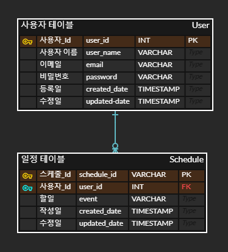

## 🌷나만의 일정 관리 앱 서버 만들기

### 🏷️ API 명세서 

| 기능           | Method | URL               | request    | 등록 정보      | 상태코드      |
| :------------- | ------ | ----------------- | ---------- | :------------- | :------------ |
| 일정 등록      | POST   | /api/schedule     | 요청 body  | 등록 정보      | 200: 정상등록 |
| 일정 조회      | GET    | /api/schedule{Id} | 요청 param | 단건 응답 정보 | 200: 정상조회 |
| 일정 목록 조회 | GET    | /api/schedule     | 요청 param | 다건 응답 정보 | 200: 정상조회 |
| 일정 수정      | PUT    | /api/schedule{Id} | 요청 body  | 수정 정보      | 200: 정상수정 |
| 일정 삭제      | DELETE | /api/schedule{Id} | 요청 param | -              | 200: 정상삭제 |

### ⛓️ERD

<<<<<<< HEAD

=======

>>>>>>> 2162fc871909527262366d7462cc235fd0744ca8
